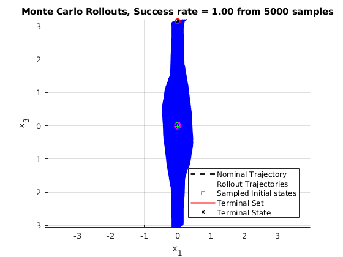
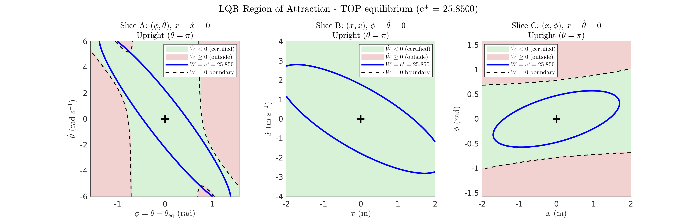

# Cart-Pole Swing-Up: Reachability & Certified Stabilization

Formal reachability guarantees for the classic cart-pole swing-up and stabilization problem. This repository combines an **energy-shaping swing-up controller**, **LQR stabilization** at the upright (and hanging) equilibrium, and **certified regions of attraction (RoA)** computed via radial line search and verified with **sum-of-squares (SOS) programming** — providing an end-to-end guarantee linking the global swing-up maneuver to the local stabilizer.

Accompanying paper: [**Reachability Guarantees for Cart-Pole Swing-Up and Stabilization**](https://arxiv.org/abs/2606.28627) (arXiv:2606.28627)

<p align="center">
  
  &nbsp;
  
</p>
<p align="center">
  <em>Left: Monte Carlo rollouts of the energy-shaping swing-up controller. Right: certified region of attraction of the LQR stabilizer at the upright equilibrium.</em>
</p>

## What's inside

The analysis pipeline answers a simple but rarely certified question: *starting from a set of initial conditions near the hanging equilibrium, is the swing-up maneuver guaranteed to deliver the state into the region of attraction of the upright LQR controller?*

The workflow is broken into sequentially numbered scripts:

| Script | Role |
|---|---|
| `Step1_energyControl_Swingup.m` | Generates the nominal swing-up trajectory under the energy-shaping control law (with feedforward cancellation), then runs Monte Carlo rollouts (`utils/checkClosedLoop_MCRollouts.m`) from perturbed initial conditions to obtain empirical min–max reachability bounds. Results are saved to `precomputedData/swing_up/`. |
| `Step1_energyControl_Swingdown.m` | Same pipeline for the swing-*down* maneuver (upright → hanging), saved to `precomputedData/swing_down/`. |
| `Step2_analyseLQR_AttractionBehavior.m` | Simulates the closed-loop LQR attractor at the top/bottom equilibria from points sampled on the boundary of a candidate invariant ellipsoid, to sanity-check the attraction behavior. |
| `Step3a_compute_RoA_lineSearch.m` | Estimates the largest invariant level set $\{x : V(x) \le c^\*\}$ of the LQR Lyapunov function via a radial line search (`fzero` along random rays), with 2-D slice visualizations of the $\dot V$ sign and the $V = c^\*$ contour. |
| `Step3b_verify_RoA_SOS.m` | Certifies a candidate level $c$ as a formal RoA via an SOS feasibility program (S-procedure multiplier of configurable degree). |
| `Step3c_find_RoA_SOS.m` | Bisection search over $c$ (upper-bounded by the line-search estimate) to find the *largest* SOS-certifiable level set. |
| `Step0_analyseOutletsInletsofFunnelLibrary.m` | Composes the pieces: loads the funnel library (`library.mat`), extracts the inlet/outlet invariance certificates of each maneuver, and computes the bounding outlet vs. contained inlet ellipsoids that establish sequential composability (outlet of swing-up ⊆ inlet of upright stabilizer, and vice versa for swing-down). |
| `saveToDictionary_Trajectory.m` | Packages a computed maneuver (time instances, nominal trajectory/control, invariance certificates, empirical bounds) into the funnel-library dictionary format used by Step 0. |

**How the scripts interact:** Steps 1–3 populate `precomputedData/` with nominal trajectories, Monte Carlo bounds, and certified RoA ellipsoids; `saveToDictionary_Trajectory.m` collects these into `library.mat`; and `Step0` operates on the completed library to verify end-to-end reachability of the composed swing-up → stabilize (and swing-down) maneuvers.

Supporting code lives in:
- `lib/` — cart-pole dynamics, TVLQR synthesis, direct-collocation trajectory generation, and plotting utilities.
- `utils/` — Monte Carlo rollout checks, trajectory downsampling, and ellipsoid bounding helpers.
- `plots/` — pre-generated figures, including the paper figures and Monte Carlo analysis.
- `precomputedData/` — saved nominal trajectories and certificates, so you can run downstream steps without recomputing everything.

## Requirements

- MATLAB (with Control System Toolbox for `lqr`/Riccati computations)
- [SOSTOOLS](https://github.com/oxfordcontrol/SOSTOOLS) (v4.00 tested) — for the SOS programs in Steps 3b/3c
- [MOSEK](https://www.mosek.com/) — SDP solver backend (free academic license available); other SOSTOOLS-compatible SDP solvers should also work with minor edits

## Quick start

```matlab
% 1. Generate nominal swing-up trajectory + Monte Carlo bounds
Step1_energyControl_Swingup      % (repeat with _Swingdown for the reverse maneuver)

% 2. (Optional) Inspect LQR attraction behavior at the equilibria
Step2_analyseLQR_AttractionBehavior

% 3. Compute and certify the LQR regions of attraction
Step3a_compute_RoA_lineSearch    % fast estimate of c*
Step3b_verify_RoA_SOS            % SOS feasibility check of a candidate c
Step3c_find_RoA_SOS              % bisection for the largest certified c

% 4. Package maneuvers into the funnel library and verify composability
saveToDictionary_Trajectory
Step0_analyseOutletsInletsofFunnelLibrary
```

Each script is self-contained (`clc; clearvars` at the top) and reads/writes through `precomputedData/`, so steps can be re-run independently. Precomputed data is included if you want to jump straight to the certification steps.

## Citation

If you find this code or analysis useful in your research, please cite the accompanying paper:

```bibtex
@misc{jaffar2026cartpole,
  title         = {Reachability Guarantees for Cart-Pole Swing-Up and Stabilization},
  author        = {M Jaffar, Mohamed Khalid},
  year          = {2026},
  eprint        = {2606.28627},
  archivePrefix = {arXiv},
  primaryClass  = {eess.SY},
  url           = {https://arxiv.org/abs/2606.28627}
}
```

## License

Released under the [MIT License](LICENSE).
